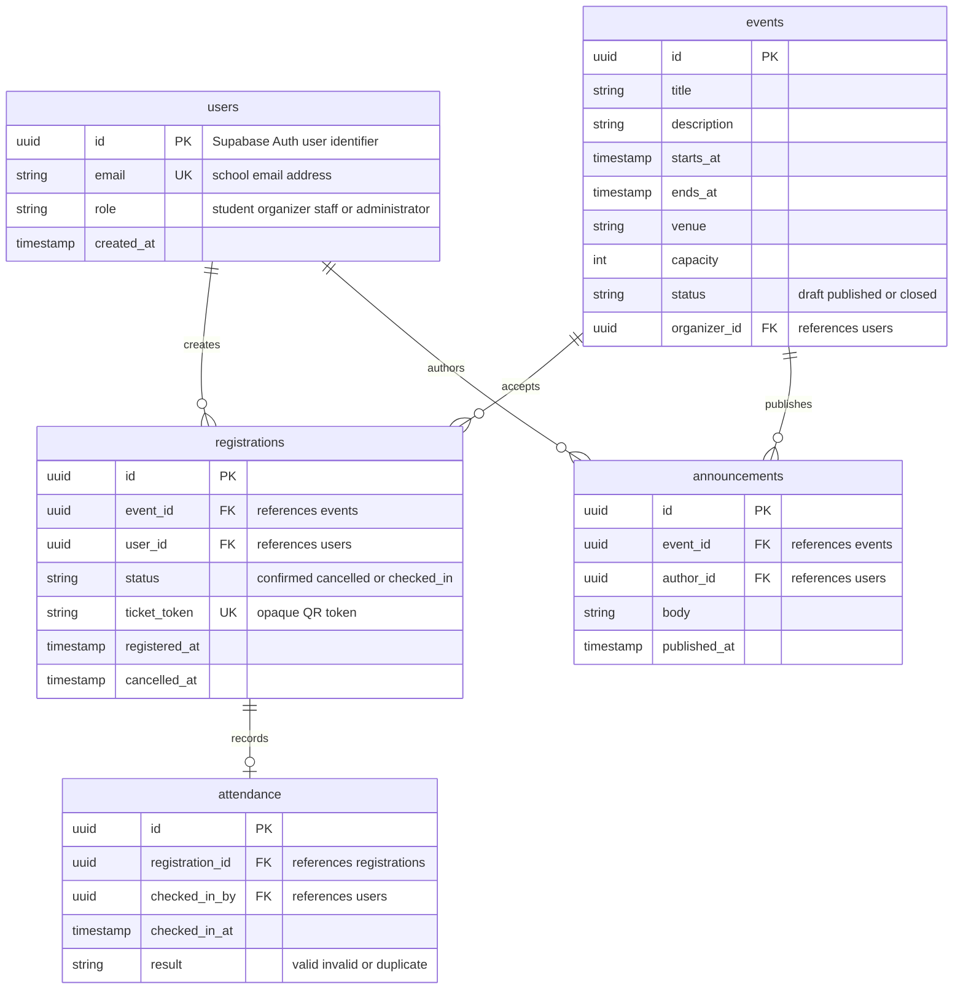

# Data Architecture & Persistence Layer

The current workspace contains a planning PRD and a generated React/Vite plus Express starter, but no implemented persistence models, migrations, or repository layer. The target data layer described below is a planned Supabase PostgreSQL model with five core entities: users, events, registrations, attendance, and announcements.

## Database Configuration

| Service/Module | DB Type | Profile | Driver | Connection | Migration Tool |
|---|---|---|---|---|---|
| Generated backend starter | PostgreSQL via Supabase | Planned development and production | `@supabase/supabase-js` client; no database driver is installed in the starter | Environment-based Supabase URL and anonymous key are referenced by `starter/backend/lib/supabaseClient.js`; values are not present | None found in the workspace; Supabase SQL migrations are planned |
| Generated backend starter | None configured locally | Local starter | None | The generated Express app currently exposes only a health route and does not open a database connection | None |

**Schema and seed status:** No DDL, Supabase migration directory, schema file, seed file, ORM configuration, connection pool, or database profile was found. The PRD and ADR define Supabase PostgreSQL as the intended store. A seeded published event is planned for the MVP, but no seed data is implemented in the starter.

## Data Ownership per Service

| Service | Tables Owned | ORM Framework | Caching | Notes |
|---|---|---|---|---|
| Student registration module | `users`, `events`, `registrations` | None implemented; planned Supabase client and SQL/RPC | None found | Owns identity profile linkage, published events, capacity records, and student reservations |
| Attendance module | `attendance` | None implemented; planned Supabase client and SQL/RPC | None found | Planned for QR verification and one attendance record per registration |
| Communication module | `announcements` | None implemented; planned Supabase client and SQL/RPC | None found | Planned for organizer announcements to registered attendees |

These are logical ownership boundaries from the PRD/ADR, not separate deployed services. The generated code currently has no entity classes or service-specific persistence implementation.

## Entity Model

The planned entity model is derived from the current PRD data model and the revised role/feature requirements. No matching source entity definitions were found in the starter. `users` represents the application profile associated with Supabase Auth users; the authentication provider remains the source of truth for credentials.

<!-- mermaid-checked: every attribute is `<type> <name> [<key>] ["<description>"]` with at most one of PK/FK/UK, no \n in descriptions, no {} in descriptions, every relationship label is double-quoted -->

**Persistence mapping observations:** The PRD requires a unique `(event_id, user_id)` registration constraint, a unique QR token, and one attendance record per registration. These constraints are planned database constraints rather than implemented ORM annotations. No transaction annotation, transaction manager, bidirectional mapping, or cascade/fetch configuration was found. The registration capacity check should be implemented as an atomic database function or transaction, not as a client-only check.

## Key Repository Methods

No repository interfaces, ORM repositories, query modules, or custom SQL methods are implemented in the current starter. The following methods are the planned persistence contract, kept intentionally limited to non-CRUD operations required by the PRD:

| Service | Repository | Notable Methods | Purpose |
|---|---|---|---|
| Student registration module | Planned `EventRepository` | `findPublishedUpcoming()`; `findByIdWithActiveCount(eventId)` | List published events and calculate capacity from active registrations |
| Student registration module | Planned `RegistrationRepository` | `registerIfCapacity(eventId,userId)`; `findByEventIdAndUserId(eventId,userId)`; `cancelBeforeDeadline(registrationId,userId)` | Atomically prevent duplicates and over-capacity registration, reuse an existing registration, and enforce the 24-hour cancellation rule |
| Student registration module | Planned `UserRepository` | `findByEmail(email)`; `findByRole(role)` | Link authenticated users to profiles and identify organizer/staff/administrator access |
| Attendance module | Planned `AttendanceRepository` | `verifyTicket(ticketToken,eventId)`; `markCheckedIn(registrationId,staffId)` | Resolve an opaque QR token, reject wrong/cancelled/already-used tickets, and record attendance once |
| Communication module | Planned `AnnouncementRepository` | `findByEventIdOrderByPublishedAtDesc(eventId)`; `createForRegisteredAttendees(eventId,body,authorId)` | Read event announcements and associate a published announcement with its author and event |
| Reporting module | Planned `AttendanceExportRepository` | `findAttendanceRowsByEventId(eventId)` | Provide a stable attendance projection to CSV and PDF generators |

Standard CRUD methods are omitted because no repository base interface exists yet. No bulk cross-service repository method is present; the planned export query is the main batch read for organizer reports.

## Caching Strategy

No caching provider, cache annotations, cache configuration, TTL, eviction policy, session cache, or second-level ORM cache was found in the workspace. The MVP should use the database as the source of truth and avoid caching registration counts because stale counts could mislead users about capacity. The planned realtime tracker can update client state through Supabase Realtime, but the registration transaction remains authoritative. If event listing traffic later requires caching, use a short cache-aside TTL for published event metadata only and invalidate it when an organizer changes an event; do not cache seat availability without a clear invalidation strategy.

## Data Ownership Boundaries

The intended topology is one shared Supabase PostgreSQL database with logical table ownership rather than database-per-service isolation. Supabase Auth owns credentials and session identity; the application profile in `users` links that identity to role and school email. Student registration owns event and registration records. Attendance and communication records reference those records through foreign keys in the shared database.

No cross-service API access or direct database access between deployed services exists in the current starter. The planned modules would use protected server-side data access or Supabase SQL/RPC functions, with Row Level Security enforcing role and row ownership. Registration reads event capacity and writes a registration atomically. Attendance reads a registration by opaque token and writes attendance. Reporting reads a controlled attendance projection rather than exposing arbitrary table access. The design is CRUD plus transactional writes, not CQRS; realtime client updates are a notification mechanism, not a separate read model.

### Data Classification & Sensitivity

| Entity | Sensitive Fields | Classification (PII/PHI/PCI/None) | Controls in Place |
|---|---|---|---|
| `users` | `email`, role-linked identity | PII | Supabase Auth is planned; RLS and role-based access are planned. Encryption at rest and masking are not configured in this workspace. |
| `events` | organizer identity through `organizer_id`; venue may reveal location details | PII | Organizer ownership and published-event policies are planned. No implemented field-level masking was found. |
| `registrations` | `user_id`, `ticket_token`, registration timestamps | PII | Student-owned row access and opaque QR tokens are planned. No implemented field-level masking was found. |
| `attendance` | `registration_id`, `checked_in_by`, attendance timestamps | PII | Staff and organizer role restrictions are planned. No implemented export redaction or field-level access control was found. |
| `announcements` | `author_id`, event-linked recipient context | PII | Event and author ownership policies are planned. No implemented masking was found. |

No PHI or PCI data is required by the current PRD. Encryption at rest is not configured by repository code; it must be confirmed as a property of the selected Supabase project and deployment settings. Export files may contain PII and require role checks, access logging, and a retention policy before FR-10 is implemented.
